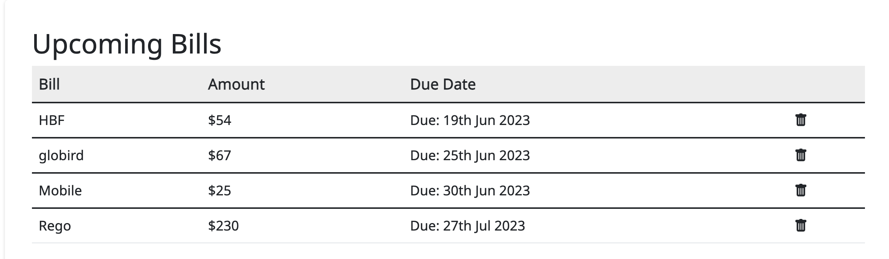

# BillEase

## Description

We have created a bill management application, to help organise your bills. Users will be able to login to view their bills, either by categories or all bills. There is also a dashboard that will show the user their 5 upcoming bills as well as how much they are spending on each category.

## Table of Contents

  - [Installation](#installation)
  - [Usage](#usage)
  - [License](#license)
  - [Contributing](#contributing)
  - [Test](#tests)
  - [Questions](#questions)

## Installation

No installation necessary. You can view the application at:

## Usage

When the user loads the web application they are brought to a login page.

If they have already created an account they can use those details to login an view their bills. If they have not already created an account they can click the link at the bottom of the sign up page, where they will be prompted to create an account. 

Once the user is logged in they are able to navigate to various page via the navbar

They can click on each link to navigate to:

-The Dashboard page, which will show the user a graph of their spending via categories, a table with category information

 and a list of the 5 upcoming bills

-The Bills page, which will show the user a list of all of their bills. Each bill also has a trash bin icon at the end of it which the user can click to delete the bills once they are done with them

-The Categories page which will show them their bill data via categories.

-The Add Bill page, where the user will also be able to add bills

## Contributing

Karra Ormsby, Josh Watson, Eilis, and Lior Moses